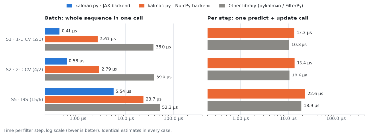
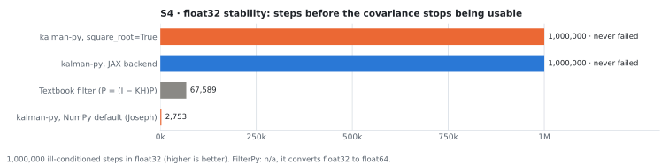
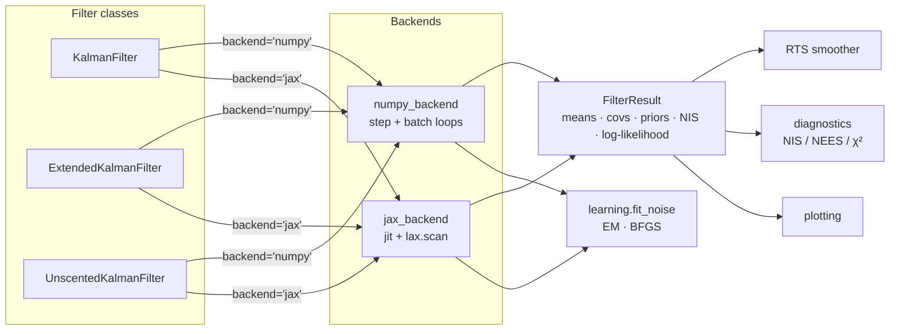

<p align="center">
  
</p>

<h1 align="center">kalman-py</h1>

<p align="center">
  <strong>Fast, exact and numerically robust Kalman filters for Python</strong>
</p>

<p align="center">
  
  <a href="./LICENSE"></a>
  
  
  
  
</p>

<p align="center">
  
  
  
  
</p>

<p align="center">
  <a href="#-quick-start"><strong>Quick Start</strong></a> ·
  <a href="#-highlights"><strong>Highlights</strong></a> ·
  <a href="#-benchmarks"><strong>Benchmarks</strong></a> ·
  <a href="#-architecture"><strong>Architecture</strong></a> ·
  <a href="#-roadmap"><strong>Roadmap</strong></a> ·
  <a href="#-development"><strong>Development</strong></a>
</p>

---

**kalman-py** is a typed Kalman filtering library with linear, extended and unscented filters,
RTS smoothers, maximum-likelihood noise learning and consistency diagnostics. It runs on NumPy
out of the box, and on an optional **JAX** backend that compiles the whole time loop with
`jax.lax.scan`. On linear-Gaussian problems it produces the same estimates as
[FilterPy](https://github.com/rlabbe/filterpy) and [pykalman](https://github.com/pykalman/pykalman)
(within 1e-11), so it can replace them without changing your results.

<p align="center">
  <picture>
    <source media="(prefers-color-scheme: dark)" srcset="docs/assets/benchmark-speed-dark.svg" />
    
  </picture>
</p>

## 📌 Project status

<table>
  <tr>
    <td align="right" valign="top" width="130">
      
    </td>
    <td valign="top">
      <strong>Linear KF, EKF and UKF with RTS smoothers</strong>, each on the NumPy and JAX backends,
      step-by-step or batch. Joseph-form and square-root covariance updates.
    </td>
  </tr>
  <tr>
    <td align="right" valign="top">
      
    </td>
    <td valign="top">
      <strong>Q/R learning</strong> by EM or gradient-based maximum likelihood, and <strong>NIS/NEES
      consistency checks</strong> with plotting helpers.
    </td>
  </tr>
  <tr>
    <td align="right" valign="top">
      
    </td>
    <td valign="top">
      <strong>Reproducible comparison</strong> with FilterPy and pykalman on five frozen scenarios
      (<a href="./tests/vectors/README.md">S1–S5</a>), shared with the C, C++ and Rust implementations.
    </td>
  </tr>
  <tr>
    <td align="right" valign="top">
      
    </td>
    <td valign="top">
      <strong>GitHub Actions workflow</strong> for Python 3.10–3.14 on Linux, macOS and Windows,
      with and without JAX, plus a comparison report. Not run on GitHub yet: the repository has
      no remote so far.
    </td>
  </tr>
  <tr>
    <td align="right" valign="top">
      
    </td>
    <td valign="top">
      <strong>Documentation site</strong> (MkDocs Material) with guides, an API reference and a
      <a href="./docs/migration.md">migration guide from FilterPy</a>, plus three
      <a href="./examples">tutorial notebooks</a>: target tracking, multi-rate sensor fusion and
      learning the noise. Not hosted yet; build it locally (see <a href="#-development">Development</a>).
    </td>
  </tr>
  <tr>
    <td align="right" valign="top">
      
    </td>
    <td valign="top">
      A first PyPI release. See the <a href="#-roadmap">roadmap</a>.
    </td>
  </tr>
</table>

## ✨ Highlights

<table align="center">
  <tr align="center" valign="top">
    <td width="33%">
      <strong>⚡ Compiled JAX backend</strong><br/><br/>
      The time loop runs in <code>jax.lax.scan</code>, compiled once and reused across filters.
      Small matrices use fused kernels instead of BLAS calls: 0.4 µs per step on a
      constant-velocity model.<br/><br/>
      <a href="#-benchmarks">Benchmarks →</a>
    </td>
    <td width="33%">
      <strong>🎯 Exact by construction</strong><br/><br/>
      Same estimates as FilterPy (within 1e-14) and pykalman (within 1e-11) on linear problems; the batch
      steady-state shortcut is bitwise identical to the full computation.<br/><br/>
      <a href="./tests/comparison">Equivalence tests →</a>
    </td>
    <td width="33%">
      <strong>🧮 Automatic Jacobians</strong><br/><br/>
      Write <code>f</code> and <code>h</code> once with <code>jax.numpy</code>: the EKF derives its
      Jacobians with <code>jax.jacfwd</code> on either backend, and the UKF needs none.<br/><br/>
      <a href="#extended-and-unscented-filters">EKF / UKF example →</a>
    </td>
  </tr>
  <tr align="center" valign="top">
    <td width="33%">
      <strong>🛡️ Numerical robustness</strong><br/><br/>
      Joseph-form updates with exact symmetry by default; <code>square_root=True</code> keeps every
      covariance positive-definite by construction, even in float32.<br/><br/>
      <a href="#float32-stability-s4">Stability results →</a>
    </td>
    <td width="33%">
      <strong>📈 Noise learning</strong><br/><br/>
      <code>fit_noise</code> estimates Q and R by EM or by BFGS on the exact likelihood (autodiff
      through the filter), reaching a higher likelihood than pykalman's EM in less time.<br/><br/>
      <a href="#learn-q-and-r-from-data">Learning example →</a>
    </td>
    <td width="33%">
      <strong>🩺 Diagnostics built in</strong><br/><br/>
      NIS/NEES consistency checks against χ² bounds (no SciPy needed) over Monte Carlo runs, and
      plots of estimates with uncertainty bands.<br/><br/>
      <a href="#check-consistency-and-plot">Diagnostics example →</a>
    </td>
  </tr>
</table>

## 🚀 Quick Start

kalman-py isn't on PyPI yet. Install it from a clone, with the optional extras you need:

```bash
pip install -e ".[jax,plot]"   # or just -e . for NumPy only
```

### Linear filter and smoother

```python
import numpy as np
from kalman_py import KalmanFilter

dt = 0.1
F = np.array([[1.0, dt], [0.0, 1.0]])  # constant velocity: state (position, velocity)
H = np.array([[1.0, 0.0]])  # measure position
Q = 0.5 * np.array([[dt**3 / 3, dt**2 / 2], [dt**2 / 2, dt]])
R = np.array([[0.25]])
kf = KalmanFilter(F, H, Q, R, x0=[0.0, 1.0], P0=np.eye(2))

rng = np.random.default_rng(0)
zs = (np.arange(1, 201) * dt + 0.5 * rng.standard_normal(200))[:, None]

# Real-time: one measurement at a time
kf.predict()
kf.update(zs[0])

# Batch: the whole sequence at once (backend="jax" compiles it), then smooth
result = kf.filter(zs)
smoothed = kf.smooth(result)
print(result.means[-1], float(result.log_likelihood))
```

`(x0, P0)` is the prior **before** the first prediction, as in FilterPy. Pass
`square_root=True` for the square-root form.

### Extended and unscented filters

```python
import jax
import jax.numpy as jnp
from kalman_py import ExtendedKalmanFilter, UnscentedKalmanFilter

jax.config.update("jax_enable_x64", True)


def f(x, dt):  # 2-D constant velocity: state (px, py, vx, vy)
    return jnp.array([x[0] + dt * x[2], x[1] + dt * x[3], x[2], x[3]])


def h(x):  # range and bearing from a sensor at the origin
    return jnp.array([jnp.hypot(x[0], x[1]), jnp.arctan2(x[1], x[0])])


def wrap_bearing(z, z_pred):  # bearing residuals in [-pi, pi)
    d = jnp.asarray(z) - jnp.asarray(z_pred)
    return d.at[1].set((d[1] + jnp.pi) % (2 * jnp.pi) - jnp.pi)


truth = np.column_stack([np.linspace(-200, -150, 100), np.linspace(60, -20, 100)])
truth = np.hstack([truth, np.tile([0.5, -0.8], (100, 1))])
radar = np.asarray(jax.vmap(h)(truth)) + rng.normal(0, [0.5, 0.01], (100, 2))

model = dict(Q=0.01 * np.eye(4), R=np.diag([0.25, 1e-4]), x0=truth[0], P0=np.eye(4))
ekf = ExtendedKalmanFilter(f, h, **model, residual_z=wrap_bearing)  # Jacobians by autodiff
ukf = UnscentedKalmanFilter(f, h, **model, residual_z=wrap_bearing, square_root=True)

ekf_result = ekf.filter(radar, dt=1.0, backend="jax")
ukf_result = ukf.filter(radar, dt=1.0, backend="jax")
ukf_smoothed = ukf.smooth(ukf_result)
```

The target crosses the negative x-axis, where bearings wrap from +π to −π; `residual_z` is all
either filter needs to handle it.

### Learn Q and R from data

```python
from kalman_py.learning import fit_noise

fit = fit_noise(F, H, zs, x0=[0.0, 1.0], P0=np.eye(2))  # gradient-based when JAX is installed
print(fit.R, fit.log_likelihood, fit.converged)
```

### Check consistency and plot

```python
from kalman_py.diagnostics import consistency_check
from kalman_py.plotting import plot_estimates

check = consistency_check(result.nis, dof=1)
print(f"{check.fraction_inside:.0%} of steps inside the 95% NIS bounds")

axes = plot_estimates(smoothed, labels=["position", "velocity"])
```

## 📊 Benchmarks

Measured against FilterPy (per-step mode) and pykalman (batch mode) on the shared scenarios in
[`tests/vectors/`](./tests/vectors/README.md), with the same inputs, seeds and precision for every
library. Estimates match in every linear case, so the comparison is about speed, stability and
features.

| Scenario | kalman-py | Best other | Result |
|---|---|---|---|
| S1 · 1-D constant velocity, batch | **0.41 µs**/step (JAX) | 38.0 µs (pykalman) | **93× faster** |
| S2 · 2-D constant velocity, batch | **0.58 µs**/step (JAX) | 39.0 µs (pykalman) | **67× faster** |
| S5 · 15-state INS, batch | **5.5 µs**/step (JAX) | 52.3 µs (pykalman) | **9.5× faster** |
| S1/S2/S5 · per-step loop | 13.3 / 13.4 / 22.6 µs | 10.3 / 10.6 / 18.9 µs (FilterPy) | 0.78–0.84× (slower) |
| S3 · range-bearing, EKF & UKF | RMSE 0.890, NEES 4.00 | RMSE 0.890 (FilterPy) | same accuracy |
| S4 · float32 stability | square-root & JAX: never fail | textbook filter: 67,589 steps | see below |

In per-step mode both libraries make the same number of small NumPy calls; kalman-py's extra
cost is the symmetrization that keeps every covariance exactly symmetric.

### Float32 stability (S4)

<p align="center">
  <picture>
    <source media="(prefers-color-scheme: dark)" srcset="docs/assets/benchmark-stability-dark.svg" />
    
  </picture>
</p>

> [!IMPORTANT]
> On this ill-conditioned float32 problem the default NumPy configuration (Joseph form) is the
> **first** to fail. Use `square_root=True` when filtering in float32.

> [!NOTE]
> These are **preliminary** numbers from a development laptop (Apple M3 Pro), not a dedicated
> machine with a fixed CPU frequency; timings can vary by 10–20% between runs. The scenario S4
> was chosen by a rule on the baseline only, recorded in its `meta.json`.

<details>
<summary><strong>Full results table</strong> (generated by <code>scripts/make_table.py</code>)</summary>

<!-- --8<-- [start:bench] -->
<!-- BENCH:START -->
Measured on Apple M3 Pro (arm64), macOS 27.0.1, python-3.12.13, commit 9a2edc7, 2026-10-05.

| Scenario | Filter | Precision | Metric | kalman-py | filterpy | kalman-py-jax | kalman-py-numpy | kalman-py-sqrt | naive | pykalman | Ours vs best other |
|---|---|---|---|---|---|---|---|---|---|---|---|
| S1 | KF batch | float64 | max_abs_diff (state) | n/a | n/a | n/a | n/a | n/a | n/a | 5.99e-12 | n/a |
| S1 | KF batch | float64 | peak_memory (bytes) | n/a | n/a | n/a | 1,524,384 | n/a | n/a | 1,136,154 | n/a |
| S1 | KF batch | float64 | rmse (state) | 0.4233 | n/a | n/a | 0.4233 | n/a | n/a | 0.4233 | 1.00x |
| S1 | KF batch | float64 | time_per_step (ns) | 406.8 | n/a | n/a | 2,606 | n/a | n/a | 38,047 | 93.53x |
| S1 | KF per-step | float64 | max_abs_diff (state) | n/a | 1.78e-15 | n/a | n/a | n/a | n/a | n/a | n/a |
| S1 | KF per-step | float64 | peak_memory (bytes) | 164,260 | 163,912 | n/a | n/a | n/a | n/a | n/a | 1.00x |
| S1 | KF per-step | float64 | rmse (state) | 0.4233 | 0.4233 | n/a | n/a | n/a | n/a | n/a | 1.00x |
| S1 | KF per-step | float64 | time_per_step (ns) | 13,252 | 10,320 | n/a | n/a | n/a | n/a | n/a | 0.78x |
| S2 | KF batch | float64 | max_abs_diff (state) | n/a | n/a | n/a | n/a | n/a | n/a | 3.32e-12 | n/a |
| S2 | KF batch | float64 | peak_memory (bytes) | n/a | n/a | n/a | 4,165,368 | n/a | n/a | 3,866,229 | n/a |
| S2 | KF batch | float64 | rmse (state) | 0.5073 | n/a | n/a | 0.5073 | n/a | n/a | 0.5073 | 1.00x |
| S2 | KF batch | float64 | time_per_step (ns) | 577.5 | n/a | n/a | 2,786 | n/a | n/a | 38,978 | 67.49x |
| S2 | KF per-step | float64 | max_abs_diff (state) | n/a | 3.55e-15 | n/a | n/a | n/a | n/a | n/a | n/a |
| S2 | KF per-step | float64 | peak_memory (bytes) | 325,324 | 324,632 | n/a | n/a | n/a | n/a | n/a | 1.00x |
| S2 | KF per-step | float64 | rmse (state) | 0.5073 | 0.5073 | n/a | n/a | n/a | n/a | n/a | 1.00x |
| S2 | KF per-step | float64 | time_per_step (ns) | 13,442 | 10,556 | n/a | n/a | n/a | n/a | n/a | 0.79x |
| S3 | EKF | float64 | nees (-) | 4.002 | 4.002 | n/a | n/a | n/a | n/a | n/a | – |
| S3 | EKF | float64 | rmse (state) | 0.8896 | 0.8896 | n/a | n/a | n/a | n/a | n/a | 1.00x |
| S3 | UKF | float64 | nees (-) | 4.001 | 3.979 | n/a | n/a | n/a | n/a | n/a | – |
| S3 | UKF | float64 | rmse (state) | 0.8896 | 0.8896 | n/a | n/a | n/a | n/a | n/a | 1.00x |
| S4 | KF | float32 | steps_to_failure (steps) | 2,753 | n/a | 1,000,000 | n/a | 1,000,000 | 67,589 | n/a | 0.04x |
| S4 | KF | float32 | steps_to_indefinite (steps) | 2,753 | n/a | 1,000,000 | n/a | 1,000,000 | 1,000,000 | n/a | 0.0028x |
| S5 | KF batch | float64 | peak_memory (bytes) | n/a | n/a | n/a | 42,821,472 | n/a | n/a | 45,672,193 | n/a |
| S5 | KF batch | float64 | rmse (state) | 0.1865 | n/a | n/a | 0.1865 | n/a | n/a | 0.1865 | 1.00x |
| S5 | KF batch | float64 | time_per_step (ns) | 5,535 | n/a | n/a | 23,730 | n/a | n/a | 52,290 | 9.45x |
| S5 | KF per-step | float64 | peak_memory (bytes) | 1,222,492 | 1,220,296 | n/a | n/a | n/a | n/a | n/a | 1.00x |
| S5 | KF per-step | float64 | rmse (state) | 0.1865 | 0.1865 | n/a | n/a | n/a | n/a | n/a | 1.00x |
| S5 | KF per-step | float64 | time_per_step (ns) | 22,639 | 18,923 | n/a | n/a | n/a | n/a | n/a | 0.84x |

- KF per-step rows: `kalman-py` is the step-by-step API (NumPy). KF batch rows: `kalman-py` is the JAX backend on CPU and `kalman-py-numpy` the NumPy backend; JAX has no peak_memory because tracemalloc can't see its buffers. max_abs_diff is the largest difference between `kalman-py` and that library's estimates.
- S3 UKF: kalman-py redraws sigma points from the predicted distribution before each update, while FilterPy reuses the propagated ones, so their estimates differ slightly; the EKFs agree to ~1e-13. A consistent filter has average NEES = 4.
- S4 (float32): FilterPy is n/a because it converts float32 inputs to float64 internally (its identity matrix is float64), so it can't run S4 as specified.
- S4: `kalman-py` is the default configuration (NumPy backend, Joseph form); `kalman-py-sqrt` uses `square_root=True`; `kalman-py-jax` is the JAX backend. 1,000,000 means the filter never failed.
<!-- BENCH:END -->
<!-- --8<-- [end:bench] -->

</details>

Reproduce everything:

```bash
ENV="$(git rev-parse --short HEAD),<cpu>,<os>,python-$(python -c 'import platform; print(platform.python_version())'),$(date +%F)"
uv run python benchmarks/run.py "$ENV"          # S1, S2, S5: speed, accuracy, memory
uv run python benchmarks/accuracy.py "$ENV"     # S3 accuracy, S4 stability
uv run python scripts/make_table.py results/results.csv kalman-py --readme README.md
uv run python scripts/plot_benchmarks.py        # the charts above
```

## 🏗️ Architecture



| Component | Responsibility |
|---|---|
| **`KalmanFilter`, `ExtendedKalmanFilter`, `UnscentedKalmanFilter`** | Validate inputs, keep the step-by-step state `(x, P)`, and dispatch `filter`/`smooth` to a backend. |
| **`backends.numpy_backend`** | Pure-function filters and smoothers; Joseph and square-root forms; exact steady-state shortcut in batch mode. Needs only NumPy. |
| **`backends.jax_backend`** | The same algorithms compiled with `jax.lax.scan`, with fused kernels for small matrices and `vmap` over sigma points. Optional. |
| **`result`** | `FilterResult` / `SmootherResult`, generic over NumPy or JAX arrays and registered as JAX pytrees. |
| **`learning`** | `fit_noise`: maximum-likelihood Q and R by EM (NumPy) or BFGS through the JAX filter. |
| **`diagnostics`, `plotting`** | NEES/NIS consistency checks with in-house χ² quantiles; matplotlib helpers (optional extra). |

## 🗺️ Roadmap

| Step | Description |
|---|---|
| **Hosted documentation** | Publish the MkDocs site (GitHub Pages) once the repository is public |
| **Release** | PyPI publishing with trusted publishing, semantic versioning and a changelog; conda-forge once the API is stable |
| **Published benchmarks** | Numbers from a dedicated, frequency-pinned machine, alongside the C, C++ and Rust implementations |

## 🛠️ Development

```bash
uv sync --all-extras          # add --group docs for the documentation tools
uv run pytest                 # fast tests
uv run pytest -m ""           # everything, including slow comparison tests
uv run ruff check && uv run ruff format --check && uv run mypy src tests

uv sync --all-extras --group docs
uv run --no-sync mkdocs serve     # documentation at http://127.0.0.1:8000
```

CI ([`.github/workflows/ci.yml`](./.github/workflows/ci.yml)) runs lint and types, the tests on
Python 3.10–3.14 × Linux/macOS/Windows (with JAX, and without it on 3.10 and 3.14), and a
comparison job. That job runs every pass condition including the slow tests, benchmarks against
FilterPy and pykalman, and compares speed with the latest `main` run. Timing regressions over
10% are reported as warnings, because shared runners vary by 10–20%; set `REGRESSION_MODE` to
`--fail` to turn them into errors.

- 🐞 **Found a bug?** Open an issue with a minimal reproduction.
- 🧪 **Changing numerics?** The equivalence tests against FilterPy and pykalman and the stability
  property tests must keep passing; benchmark scenarios in `tests/vectors/` are frozen.
- 📐 **Conventions:** filters predict before the first update; covariances stay exactly symmetric;
  float32 inputs stay float32 end to end.
- 📚 **Docs and tutorials:** code in the README and in `docs/` is executed by the tests, and the
  notebooks in `examples/` are re-run in CI, so keep them runnable.

## 🙏 Acknowledgements

kalman-py is measured against, and owes a great deal to, [FilterPy](https://github.com/rlabbe/filterpy)
and [pykalman](https://github.com/pykalman/pykalman), and is built on [NumPy](https://numpy.org) and
[JAX](https://github.com/jax-ml/jax).

## 📄 License

Released under the [MIT License](./LICENSE).
